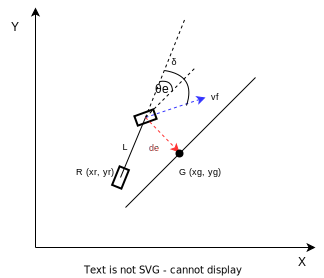
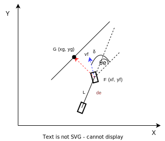

# 3. Trajectory Following

In this chapter, we will learn how to make a vehicle follow a predefined trajectory. We will start by creating a trajectory using waypoints and then implement a controller to make the vehicle follow the trajectory. We will also learn how to visualize the trajectory and the vehicle's path in the CARLA simulator.


## 3.1 Trajectory Generation

Trajectory vs Path:

- A trajectory is a sequence of states (position, velocity, and acceleration) of a vehicle over time. This typically is generated from a motion planner or a trajectory optimization algorithm.
- A path is a sequence of waypoints that define the position of the vehicle over time.

For simplicity in this chapter, we will use the terms trajectory and path interchangeably, which means we will use a sequence of waypoints to define the trajectory of the vehicle.

The map is assumed to be perfectly known, and the trajectory can then be generated from a minimum distance graph search algorithm, such as A* or Dijkstra's algorithm. 

## 3.2 Trajectory Following

Trajectory following is the process of making a vehicle follow a predefined trajectory. This is achieved by implementing a controller that computes the steering, throttle, and brake commands to make the vehicle follow the trajectory. The controller can be a simple PID controller or a more complex model predictive controller (MPC).

### 3.2.1 Basics

#### 3.2.1.1 Lateral Control Errors





The lateral control error is the distance between the vehicle's position and the desired path. There are two types of lateral control errors:
- heading error $\theta_e$: the angle between the vehicle's heading and the desired path.
- cross-track error $d_e$: the distance between the vehicle's position and the desired path.


**Heading Error**
$$
\theta_e = \theta_g - \theta
$$

where $\theta_g$ is the desired heading angle (heading angle of the target point) and $\theta$ is the current heading angle of the vehicle. 

**Cross-Track Error**
The sign of the cross-track error is defined as follows to unify the control policy calculation:
- if the vehicle is on the left side of the path, the error is positive
- if the vehicle is on the right side of the path, the error is negative
  
$$
e = (x_g - x_f, y_g - y_f) \\

d_e = \begin{cases}
||e||, & \text{if } \text{vehicle on the left} \\
-||e||, & \text{if } \text{vehicle on the right}
\end{cases} \\
\dot d_e = -v_fsin(\delta+\theta_e)
$$
where $e$ is vector from vehicle position to goal point, $d_e$ is cross-track error, $v_f$ is the forward velocity of the vehicle, $\delta$ is the steering angle, and $\theta_e$ is the heading error. 
The negative sign before $v_f$ is due to the error design:
- when the vehicle is on the left, the error is positive, and the error should decrease faster (towards 0) if the velocity is greater, which means the error change rate should be negative.
- when the vehicle is on the right, the error is negative, and the error should increase faster (towards 0) if the velocity is greater, which means the error change rate should be positive.

**How to decide if vehicle is on the left or right of the path ??**
- using cross-product of the vehicle heading vector and the vector from the vehicle to the goal point. Based on the right-hand coordinate system, if the cross-product is positive, the vehicle is on the right side of the path, and the error is negative. If the cross-product is negative, the vehicle is on the left side of the path, and the error is positive.


### 3.2.2 Pure Pursuit Controller

Pure pursuit is a tracking algorithm that works by calculating the curvature that will move a vehicle from its current position to a goal position. The goal position is a point on the path that is a lookahead distance away from the vehicle. The curvature is then used to calculate the steering angle of the vehicle.

Since the vehicle has already deviated from the path, the controller has to guide the vehicle back to the path through a new `path` or arc. The controller calculates the steering angle based on the curvature of the arc and the lookahead distance.


**Inertia Frame**

Assuming the desired point is the center of rear wheels, Pure pursuit algorithm in the inertial frame is shown as below.

$$
R = \frac{L_d}{2sin(\alpha)}
$$

Thus, the curvature of the arc is:

$$
k = \frac{1}{R} = \frac{2 sin(\alpha)}{L_d}
$$

To follow the arc, using kinematic bicyle model, the steering angle $\delta$ is:

$$
\delta = arctan(kL)
$$

where $L$ is the distance between the front and rear axles of the car.
Combining the above two equations, we get:

$$
\delta = arctan(\frac{2Lsin(\alpha)}{L_d})
$$


The angle between the vehicle heading and the path $\alpha$ can be calculated as:

$$
\alpha + \theta = arctan(\frac{y_g - y_r}{x_g - x_r})
$$

where $(x_g, y_g)$ is the goal point coordinates, and $(x_r, y_r)$ is the current pose of the vehicle rear wheels, $\theta$ is the yaw angle or heading angle of the vehicle.

QUESTIONS:

- what is the default direction of steering? negative for left, positive for right?


**Procedure**

if using vehicle frame, 
- find a new pose ($x_r, y_r, \theta_r$) of the car
- find the path point cloest to the car: it is possible that there multiple points one lookahead distance away from the car, in this case, the closest one (the one with least distance along the path) is chosen.
- transform the goal point to the vehicle frame
- go towards that waypoint with calculated steering angle
- localize the car with the new pose

**Tuning**

the look ahead distance $L_d$ is a parameter in the algorithm.
- A smaller $L_d$ leads to more aggressive maneuvering to follow a closer arc, and closer arcs can work against the dynamic limits of the car
- A larger $L_d$ leads to smoother maneuvering, but the car may not follow the path as closely, thus, leading to higher tracking errors.


The lookahead distance is usually chosen to be a function of the speed of the vehicle, so that $\omega$ will not become more sensitive to $\alpha$ when $v_r$ is higher. The higher the speed, the higher the lookahead distance. This is because at higher speeds, the vehicle will cover more distance in the time it takes to react to the path. Thus, the lookahead distance should be higher to ensure that the vehicle has enough time to react to the path.

**Notes**

If crosstrack error (e) is defined here as lateral distance between the heading vector and the goal point, then

$$
sin \alpha = \frac{e}{L_d}
$$

Thus, the steering angle is:

$$
\delta = arctan(\frac{2Lsin(\alpha)}{L_d}) = arctan(\frac{2Le}{L_d^2})
$$

- Pure pursuit is a porportional controller.
- The proportional gain $\frac{2L}{L_d^2}$ can be tuned at different speeds by creating a relationship between the speed and the lookahead distance. 

$$
L_d = k_v v_r
$$

$$
\delta = arctan(\frac{2Lsin \alpha}{k_vv_r})
$$

#### 3.2.3 Stanley Controller
I found the explanation of the stanley controller is a mess in the internet, and hard to understand. 
Generally, the stanley control law has two general format in the literature:

$$
\delta = \theta_e + arctan(\frac{k d_e}{v_f})
$$

or 

$$
\delta = -\theta_e - arctan(\frac{k d_e}{v_f})
$$

This mess is due to the definition of some variables. 

**METHOD 1**

some definitions:
- $d_e$ is the cross-track error, which is positive if the vehicle is on the left side of the path, and negative if the vehicle is on the right side of the path. 
- $v_f$ is the forward velocity of the vehicle.
- $\theta_f$ is the yaw angle of the vehicle front wheels.
- $\theta$ is the yaw angle of the vehicle.
- $\delta$ is the **steer angle**, and $\delta = \theta_f - \theta$. 
    - if $\delta$ is positive, the vehicle is steered left
    - if $\delta$ is negative, the vehicle is steered right
    - **NOTE: typically we use negative for steering left, and positive for steering right. In this case, we do the opposite**
- $\theta_e$ is the yaw angle of the vehicle relative to the nearest path segment, $\theta_e = \theta - \theta_g$
- $k$ is stanley gain, positive 

When the vehicle is at the left side of the path as shown in the above figure, we have
- $\theta > 0$
- $\theta_g > 0$
- $\theta_e > 0$
- $\delta < 0$
- $d_e > 0$


The change rate of cross-track error can be shown as:
$$
\dot d_e = v_fsin(\delta+\theta_e)
$$

To design a expontial converging controller, we have:
$$
\dot d_e = -k d_e
$$

This gives:
- if the vehicle is on the left side of the path, the error is positive, and will expontially decay to 0
- if the vehicle is on the right side of the path, the error is negative, and will expontially converge to 0

Combining the above two equations, we have:

$$
    v_fsin(\delta+\theta_e) = -k d_e
$$

Therefore, 

$$
\delta = -arcsin(\frac{k d_e}{v_f}) - \theta_e
$$

Thus, when the vehicle is on the left side of a path, the steer command should be negative to turn the vehicle right.


When the vehicle is on the right side of a path as shown in above figure, we have:
- $\theta > 0$
- $\theta_g > 0$
- $\theta_e < 0$
- $\delta > 0$
- $d_e < 0$

We can reach the same steer control policy using the above equations.


**METHOD 2**
The Stanley paper uses the following definitions to derive the control policy:
- $\delta$ is the steer angle, and $\delta = \theta - \theta_f$. 
    - negative for steering left 
    - positive for steering right
    - **Note: this is a conventional definition**


When vehicle is on the left side of a path as shown in the above figure, we have:
- $\theta > 0$
- $\theta_g > 0$
- $\theta_e > 0$
- $\delta > 0$
- $d_e > 0$

The change rate of cross-track error can be shown as:
$$
\dot d_e = v_fsin(\theta_e - \delta)
$$

To design a expontial converging controller, we have:
$$
\dot d_e = -k d_e
$$

After rearranging, we have:
$$
\delta = arcsin(\frac{k d_e}{v_f}) + \theta_e
$$

Thus, when the vehicle is on the left side of a path, the steer command should be positive to turn the vehicle right.

We can have the same control policy when the vehicle is on the right side of the path.


**NOTES**

Therefore, the key here is the definition of steer angle.
- if the environment uses negative for steering left, and positive for steering right, then choose `METHOD 2`
- if the environment uses positive for steering left, and negative for steering right, then choose `METHOD 1`


Because $sin()$ is bound to $[-1, 1]$, to aovid easy saturation, the steering angle can be rewritten as:
$$
\delta = arctan(\frac{k d_e}{v_f}) + \theta_e
$$

For small steering, the above can still maintain a local exponential convergence. 

To avoid oversensitivity to the cross-track error, the steering angle can be further modified as:
$$
\delta = arctan(\frac{k d_e}{k_v + v_f}) + \theta_e
$$
where $k_v$ is a soft gain to tune the sensitivity of the controller to the cross-track error. The stanley paper suggests $k_v = 1 m/s$.

By adding the physical constraints of maximum steering angle, the steering angle can be further constrained to $[-\delta_{max}, \delta_{max}]$.


### 3.2.4 PID Controller

**Longitudinal Control**: this controller is used to control the speed of the vehicle. It computes the throttle and brake commands to make the vehicle follow the desired speed. The throttle is within [-1, 1], where -1 is full brake and 1 is full throttle.

```python
throttle = PID(speed, desired_speed)
```

**Lateral Control**: this controller is used to control the steering of the vehicle. It computes the steering command to make the vehicle follow the desired trajectory. The steering is within [-1, 1], where -1 is full left and 1 is full right.


The angle between vehicle forward vector and waypoint forward vector is used to measure the error.
Following right-hand coordinate system, the cross product of the vehicle forward vector and the waypoint forward vector is used to determine the sign of the error.


**TODO: need work on this**

If the angle is within `[0, pi]`, the cross vector points positive direction. The vehicle is on the right side of the waypoint, when the error gets larger, more steering torward left is needed. 
If the angle is within `[pi, 2*pi]`, which means the vehicle is on the left side of the waypoint, the error is negative.


#### 3.2.1.1 PID Controller Tuning


### 3.2.2 Model Predictive Controller (MPC)

