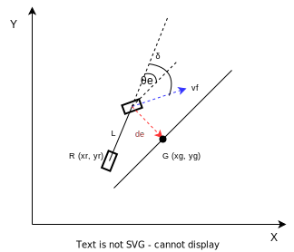
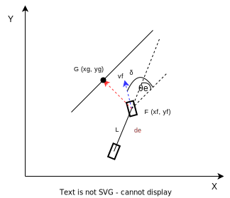

# 3.1 Basics

## 3.1.1 Lateral Control Errors

The lateral control error is the distance between the vehicle's position and the desired path. There are two types of lateral control errors:
- heading error $\theta_e$: the angle between the vehicle's heading and the desired path.
- cross-track error $d_e$: the distance between the vehicle's position and the desired path.

**Heading Error**

$$
\theta_e = \theta_g - \theta
$$

where $\theta_g$ is the desired heading angle (heading angle of the target point) and $\theta$ is the current heading angle of the vehicle. 

**Cross-Track Error**
The sign of the cross-track error is defined as follows to unify the control policy calculation:
- if the vehicle is on the left side of the path, the error is positive
- if the vehicle is on the right side of the path, the error is negative
  

$$e = (x_g - x_f, y_g - y_f)$$ 

$$
d_e = \begin{cases}
  ||e||, & \text{if } \text{vehicle on the left} \\
  -||e||, & \text{if } \text{vehicle on the right}
  \end{cases}
$$

$$\dot d_e = -v_fsin(\delta+\theta_e)$$

where $e$ is vector from vehicle position to goal point, $d_e$ is cross-track error, $v_f$ is the forward velocity of the vehicle, $\delta$ is the steering angle, and $\theta_e$ is the heading error. 
The negative sign before $v_f$ is due to the error design:
- when the vehicle is on the left, the error is positive, and the error should decrease faster (towards 0) if the velocity is greater, which means the error change rate should be negative.
- when the vehicle is on the right, the error is negative, and the error should increase faster (towards 0) if the velocity is greater, which means the error change rate should be positive.

**How to decide if vehicle is on the left or right of the path ??**
- using cross-product of the vehicle heading vector and the vector from the vehicle to the goal point. Based on the right-hand coordinate system, if the cross-product is positive, the vehicle is on the right side of the path, and the error is negative. If the cross-product is negative, the vehicle is on the left side of the path, and the error is positive.

